# 🏥 Black-Box Penetration Test: Mediroza General Hospital (Capstone)

**Four "minor" findings walked into a hospital's backend and walked out with the entire staff payroll.**

[]()
[]()
[]()
[]()
[]()

---

## 📌 Continuity Note

This is the capstone of the series, Week 4 of the Cybersecurity & Ethical Hacking Internship at Networkwalks. Also part of this series:

- **Week 1:** [Kali-Linux-Lab-Setup-in-Virtualbox](https://github.com/suvayanghosh/Kali-Linux-Lab-Setup-in-Virtualbox)
- **Week 2:** [Footprinting-Reconnaissance-Lab](https://github.com/suvayanghosh/Footprinting-Reconnaissance-Lab)
- **Week 3:** [Password Cracking with JTR & NetworkWalks Tools](https://github.com/suvayanghosh/Password-Cracking-with-JTR-NetworkWalks-Tools)

---

## 📑 Table of Contents

- [Backstory](#-backstory)
- [What I Set Out to Do](#-what-i-set-out-to-do)
- [Engagement Brief](#️-engagement-brief)
- [Scope & Authorization](#️-scope--authorization)
- [Tools & Techniques Used](#-tools--techniques-used)
- [Walkthrough](#-walkthrough)
- [Attack Chain at a Glance](#-attack-chain-at-a-glance)
- [Findings & Risk Ratings](#-findings--risk-ratings)
- [Lessons Learned](#-lessons-learned)
- [Ethical Use Notice](#-ethical-use-notice)
- [Tools & Resources](#-tools--resources)
- [Author](#-author)
- [Project Info](#-project-info)

---

## 📖 Backstory

Weeks 1 through 3 were single-tool exercises. Build a lab, run a recon tool, crack a password. Week 4 stopped handing out individual tools and handed out a client instead.

Mediroza General Hospital, five days, one black-box engagement: no credentials, no source code, no map of the application, just a domain and four milestones that each depended on getting the one before it right. What started as routine footprinting ended up chaining a disclosed directory, a login form that trusted raw input, and a forgotten developer comment into full, unauthenticated access to the hospital's staff salary and shareholder records. Nothing in that chain was individually dramatic. Together, it was the entire point of the exercise.

---

## 🎯 What I Set Out to Do

- Attack `medirozahospital.com` from a true black-box starting point with no credentials, no source, nothing handed over beyond the domain itself.
- Find a way into a restricted area of the site and retrieve the 3 confidential patient PDF lab reports behind it.
- Treat each of those 3 files as its own problem and recover the password protecting each one.
- Go back over everything already collected, rather than stopping at "files decrypted," and follow wherever that led.
- Package four milestones of technical findings into one professional, risk-rated report a hospital stakeholder could actually read and act on.

---

## 🗂️ Engagement Brief

| Field | Detail |
| --- | --- |
| Client | Mediroza General Hospital |
| Target | `https://medirozahospital.com` |
| Engagement Type | Full black-box penetration test |
| Duration | 5 days |
| Batch | B083, Week 4 |
| Rules of Engagement | Testing limited to the target domain only. No social engineering. No denial of service. No testing outside agreed scope. |

**Milestones:**

| # | Milestone | Goal |
| --- | --- | --- |
| M1 | Initial Access | Attack the website and retrieve 3 confidential patient PDF lab reports |
| M2 | Data Extraction | Crack the encryption on all 3 retrieved files |
| M3 | Critical Data Exposure | Find the staff salary and shareholder details of the hospital |
| M4 | Pentest Report | Write a professional penetration testing report for the client |

---

## 🛡️ Scope & Authorization

| Target | Basis for Testing |
| --- | --- |
| `medirozahospital.com` | Provided and authorised by Networkwalks Academy as a simulated training target for this capstone exercise |

⚠️ **Disclaimer:** Mediroza General Hospital is a simulated lab environment built for this course; not a real hospital, and not real patient data. Written permission for this engagement was granted as part of the assignment. These techniques should never be used against a system you don't own or have explicit authorization to test.

---

## 🧰 Tools & Techniques Used

| Tool / Technique | Purpose |
| --- | --- |
| 🔍 whois / nslookup | Domain registration and DNS footprinting |
| 🗺️ nmap | Port scanning to map every service exposed, not just the web app |
| 🧱 wafw00f | Identified the WAF sitting in front of the site |
| 📂 curl | Header inspection, path probing, and pulling the exposed database backup |
| 💉 Manual SQL Injection | Authentication bypass on the patient portal login |
| 🧮 NetworkWalks Hash Calculator & Password Cracker | PDF hash extraction and dictionary-attack cracking |
| 🏷️ exiftool | PDF metadata inspection |

---

## 🪜 Walkthrough

### M1 — Initial Access

Recon came first.

`whois` against `medirozahospital.com` showed a domain registered through NameCheap only weeks before testing began, registrant details sitting behind third-party privacy protection. Not unusual on its own, but worth noting for the report.

`nslookup` resolved the domain to `199.188.201.16`. An `nmap` scan against that IP turned up considerably more than a single web server: 11 open ports in total, including a full mail stack (`pop3`, `imap`, `smtps`, `submission`, `imaps`, `pop3s`) and an open FTP port (`21`) alongside the expected `http`/`https`. None of that was in scope to exploit further for this engagement, but it's exactly the kind of extra attack surface worth flagging in the final report.

`wafw00f` confirmed the site sits behind a LiteSpeed WAF; a detail that matters more for the report's methodology section than for the attack itself, since nothing here needed to go near it.

`curl -I` against a handful of likely paths confirmed `robots.txt` existed and was reachable (132 bytes, served as plain text) and that's where this stopped being routine. Reading it disclosed three paths that were clearly never meant to be advertised: `/patient/`, `/staff/`, `/old/`. All three were directly accessible with no authentication in front of any of them. (Worth a side note: `/wp-content/` returned a 404, which is unusual for a WordPress install and suggests the default structure had been altered.)

`/patient/` turned out to have directory listing enabled, which handed over the portal's full file structure along with its login form.

#### 💉 A closer look: the SQL injection

The login form took a username and password and, somewhere on the backend, clearly dropped both straight into a query without sanitising either. Rather than guessing at credentials, the first move was to test the input itself:

- Typed a single quote (`'`) into the username field on its own and submitted the form. Instead of a clean "invalid login" message, the page threw back a database error. Thus, a strong sign the input was landing directly inside a raw SQL query instead of a parameterised one.
- That confirmed the query was shaped roughly like:

  ```sql
  SELECT * FROM users WHERE username = '$username' AND password = '$password'
  ```

  with `$username` and `$password` substituted in from the form, unescaped.
- From there, the payload wrote itself: `admin'--` in the username field, with the password field left blank. The closing quote ends the string early, and `--` comments out everything after it, including the entire `AND password = '...'` check. The query the database actually ran effectively became:

  ```sql
  SELECT * FROM users WHERE username = 'admin'--' AND password = ''
  ```
- The server logged the session in as `admin`. No valid password was ever typed, guessed, or needed — authentication wasn't bypassed so much as it was never actually enforced.

Inside the "authenticated" portal: three encrypted PDF lab reports — `patient_report_1.pdf`, `patient_report_2.pdf`, `patient_report_3.pdf` — exactly as the milestone asked for.

**Evidence:**

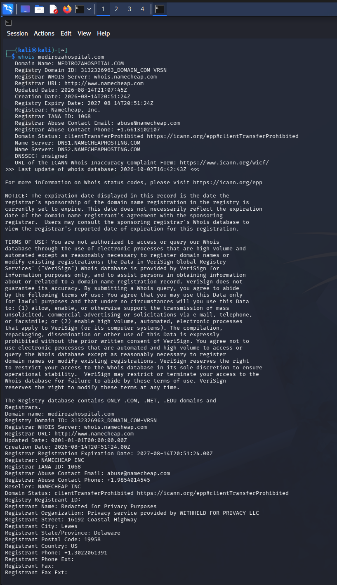
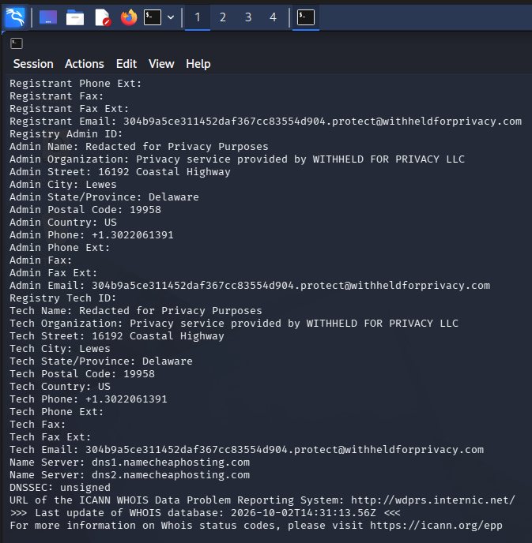
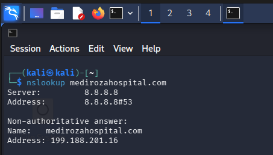
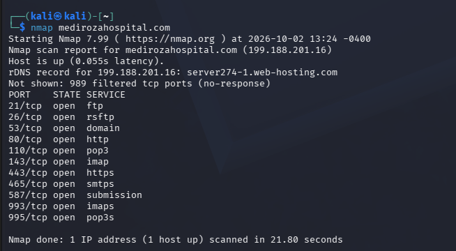
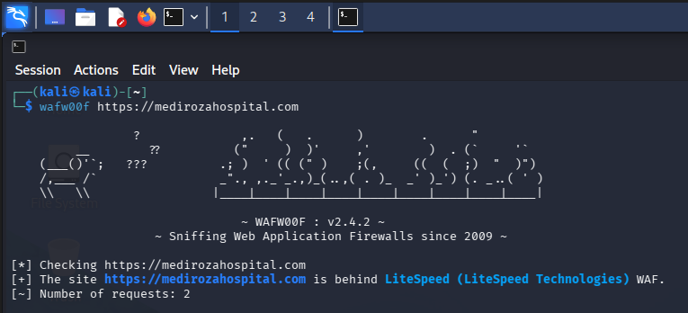
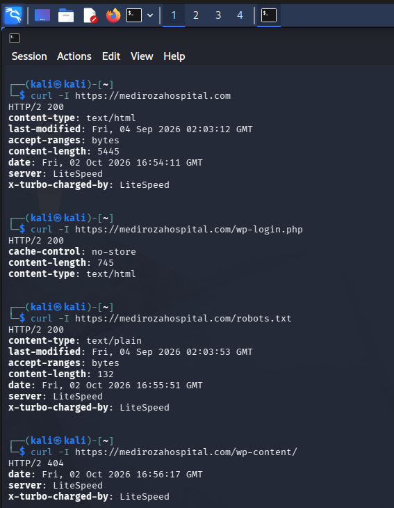
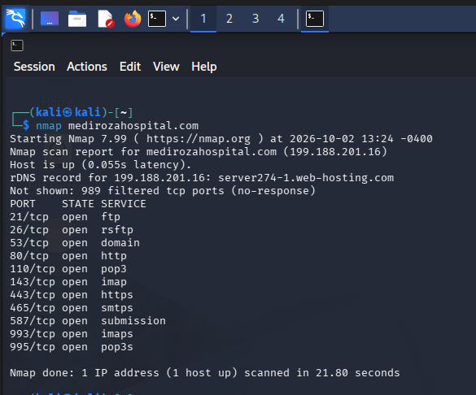

### M2 — Data Extraction

Three files, three separate problems. The brief's warning not to assume one approach would crack all of them held up exactly as written. Each PDF's hash was pulled with the NetworkWalks Hash Calculator and run through the Password Cracker's dictionary attack individually.

| File | Password Recovered | Notes |
| --- | --- | --- |
| `patient_report_1.pdf` | `123456` | First attempt, built-in wordlist |
| `patient_report_2.pdf` | `password` | Second attempt, built-in wordlist |
| `patient_report_3.pdf` | `!@#$%^&` | Needed the custom wordlist match landed at attempt 3,546 of 3,556 |

Two of the three gave up almost instantly. The third one was clearly chosen to make a point about wordlist coverage, and it made it well.

**Evidence:**

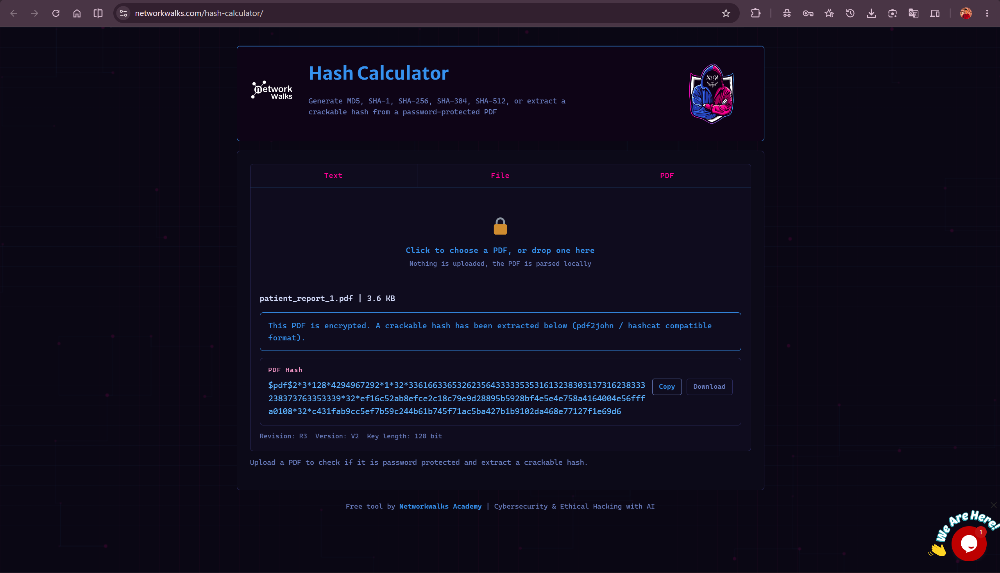
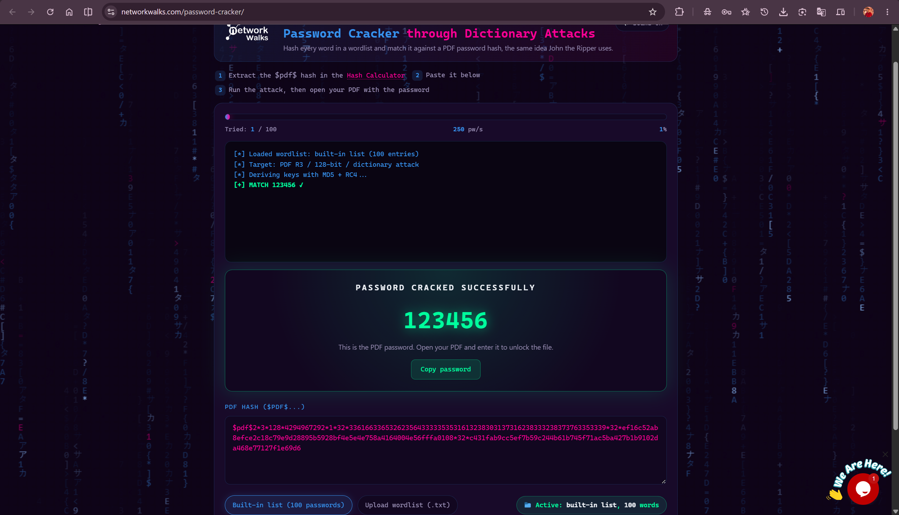

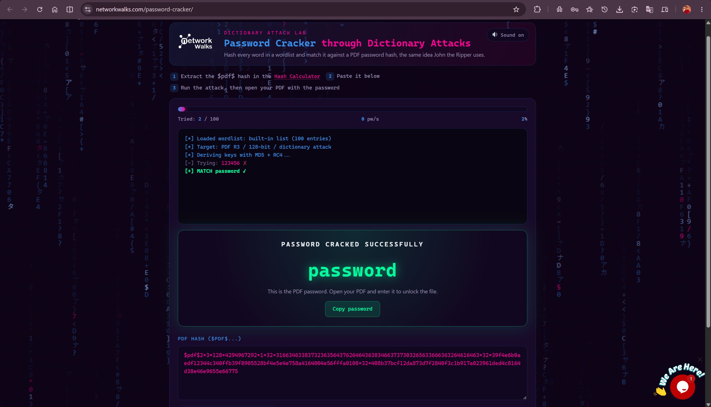
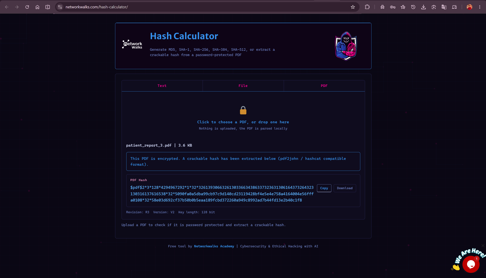
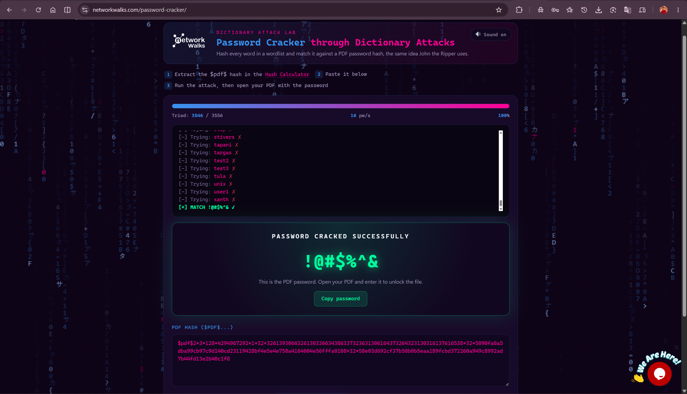
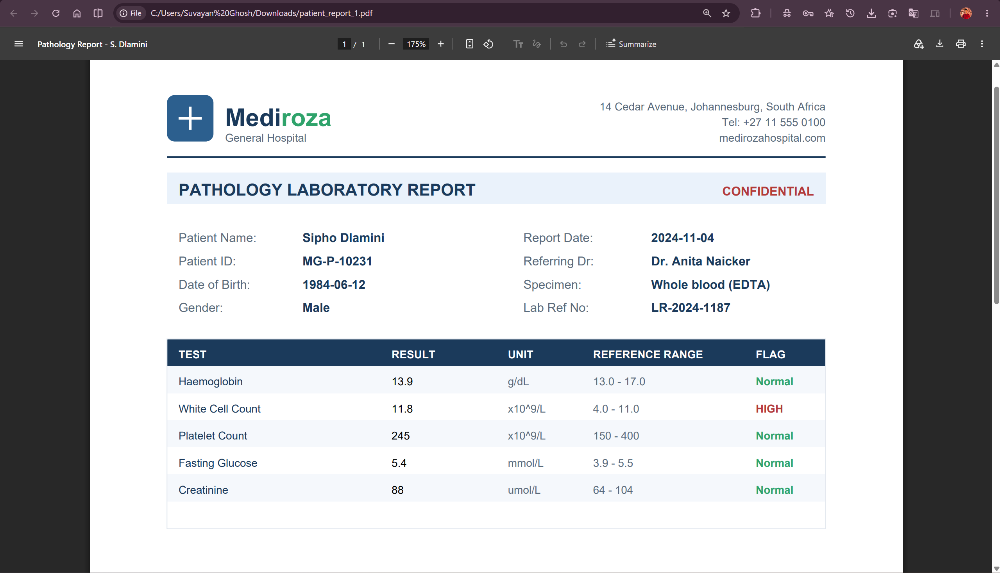
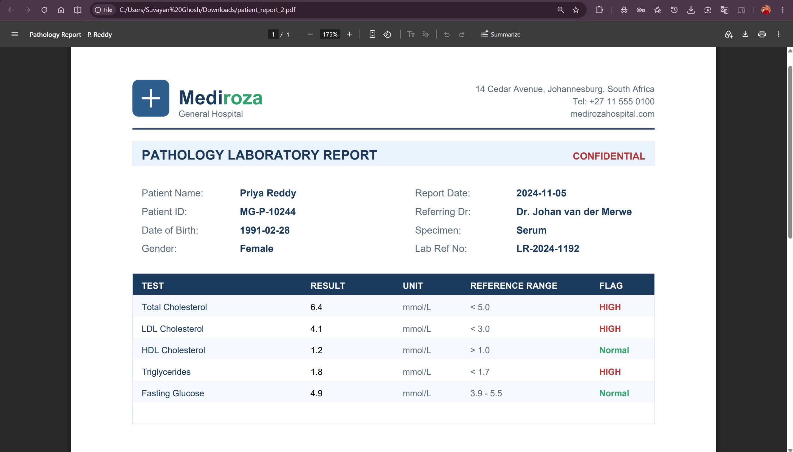


*(The three opened reports are genuine simulated lab data created for this exercise, names, IDs and results included, so they're kept to screenshots here rather than reproduced in text.)*

### M3 — Critical Data Exposure

The milestone's hint said to look beyond the obvious content and check file properties carefully, so `exiftool` went over all three decrypted PDFs before calling this milestone done. One of them, `patient_report_3_decrypted.pdf`, had an internal comment sitting in its metadata: *"DB backup moved to /old before site migration, do not delete"*, alongside an internal username, `j.malik`, left in the Author field.

That was a direct pointer back to `/old/` one of the three paths `robots.txt` had already disclosed in M1, and still just as unauthenticated as the rest of the site. A directory listing there showed a single file, `mediroza_db_backup_2019.sql`, pulled straight down with `curl`. Its own header comments didn't hold back about what it contained:

```sql
-- Mediroza General Hospital - internal database backup
-- Generated by Mediroza CMS 1.4.2 backup module
-- Host: localhost   Database: mediroza_hr
-- WARNING: contains confidential staff and shareholder records
-- Backup date: 2019-08-27 02:14:03
```

It wasn't exaggerating. The `staff` table alone contained full records for 30 employees, names, job titles, departments, emails, phone numbers, national ID numbers, and monthly salaries in ZAR which was openly readable in an unauthenticated SQL dump sitting on a live web server. The same backup's own warning comment confirms shareholder ownership records sit alongside it in the full file.

Three milestones that looked unrelated on paper turned out to be one continuous thread.

**Evidence:**

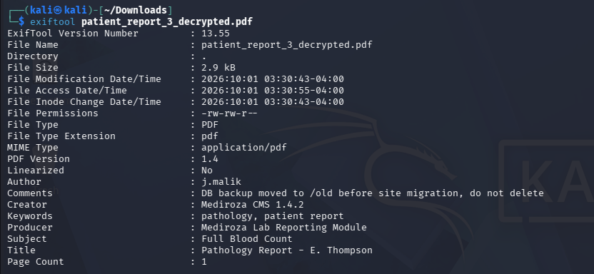
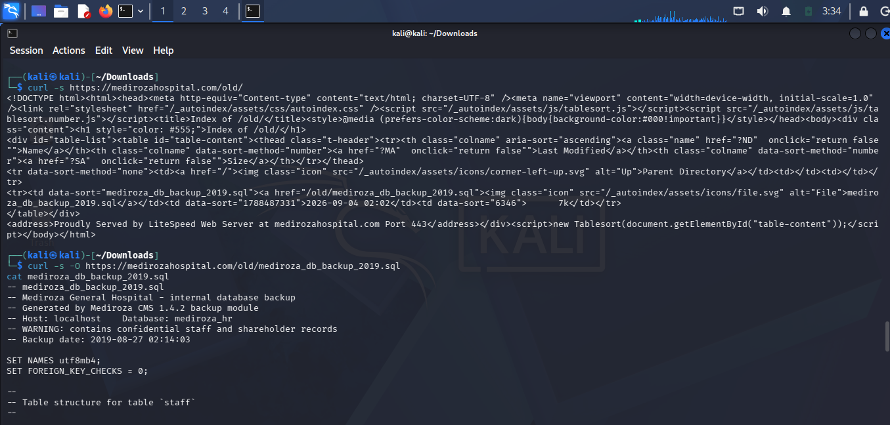
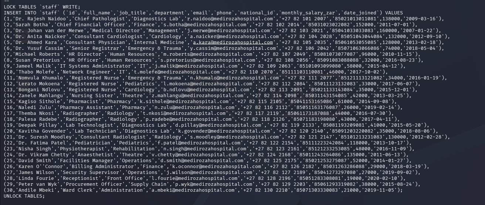

### M4 — Pentest Report

Everything above was written up as a full professional penetration testing report for the client, structured the way the engagement required it:

| # | Section | Covers |
| --- | --- | --- |
| 01 | Executive Summary | A concise overview of the engagement, key findings, and overall risk to the client |
| 02 | Scope and Methodology | Target, tools used, approach taken, and any limitations encountered |
| 03 | Findings and Proof of Exploitation | Each vulnerability with screenshots and evidence for every milestone |
| 04 | Risk Rating | Every vulnerability rated Critical, High, Medium or Low with justification |
| 05 | Recommendations and Remediation | Actionable steps the client should take to fix each identified issue |

📄 Full report: [Mediroza Pentest Report M4](Mediroza-Pentest-Report-M4.pdf)

---

## 🔗 Attack Chain at a Glance

1. Recon (`whois`, `nslookup`, `nmap`) fingerprints the target and finds 11 open ports, not just the web app.
2. `wafw00f` confirms a LiteSpeed WAF; noted, but never actually in the way.
3. `robots.txt` discloses three paths that should never have been listed: `/patient/`, `/staff/`, `/old/`.
4. Directory listing on `/patient/` exposes the portal's login form.
5. `admin'--` bypasses that login form entirely; no credentials needed.
6. Three encrypted PDF lab reports are retrieved from inside the portal.
7. A dictionary attack cracks all three - `123456`, `password`, `!@#$%^&` (the last one taking the full 3,556-word list).
8. PDF metadata on one file leaks a developer comment pointing straight at `/old/`.
9. `/old/` turns out to be an unauthenticated, exposed database backup having full staff salary and shareholder records, no login required.

Nine steps, none of them exotic, all of them necessary for the next one to matter.

---

## 📊 Findings & Risk Ratings

| Finding | Risk |
| --- | --- |
| SQL injection bypassing patient portal authentication | 🔴 Critical |
| Unauthenticated, publicly exposed database backup | 🔴 Critical |
| Internal developer comment + username leaked via PDF metadata | 🟠 High |
| Directory listing enabled on a sensitive path | 🟠 High |
| `robots.txt` disclosing unprotected, sensitive paths | 🟡 Medium |
| Dictionary-crackable PDF passwords | 🟡 Medium |
| Non-web services (FTP, full mail stack) exposed alongside the web app | 🟢 Low |

Full evidence, write-up and remediation guidance for each of these sits in the M4 report.

---

## 💡 Lessons Learned

**Small issues compound.** A disclosed path, an enabled directory listing, and an unsanitized login field are each the kind of finding that's easy to rate as "minor" in isolation. Chained together, they handed over an entire backend.

**SQL injection is still shockingly effective.** It didn't take anything clever, just a login form that trusted whatever was typed into it, and the oldest payload in the book.

**Metadata is its own attack surface.** None of the three PDFs leaked anything through their visible content. All the damage came from what was sitting quietly in their properties.

**Encryption protects a file, not the system around it.** All three PDFs were password-protected, and none of that mattered once the bigger exposure sitting next to them had no protection at all.

**Recon should cover more than the thing you're told to test.** The nmap scan turned up a full mail stack and an open FTP port that had nothing to do with the assigned milestones. But still worth a line in the report, because a client deserves to know their full exposed surface, not just the slice that was in scope.

**A finding is only useful once it's written for the person who has to act on it.** Four milestones of technical output don't mean much to a hospital stakeholder until they're translated into a clear, risk-rated report with next steps attached.

---

## 🔐 Ethical Use Notice

This engagement was carried out strictly as an educational capstone project, against a simulated target explicitly authorised by Networkwalks Academy for this exercise. No real hospital, patient, or third-party system was involved. Please don't repoint any of these techniques at a system you don't own or have explicit permission to test.

---

## 🔗 Tools & Resources

- **Nmap:** <https://nmap.org/>
- **Wafw00f:** <https://github.com/EnableSecurity/wafw00f>
- **NetworkWalks Hash Calculator:** <https://networkwalks.com/hash-calculator/>
- **NetworkWalks Password Cracker:** <https://networkwalks.com/password-cracker/>
- **ExifTool:** <https://exiftool.org/>

---

## 👤 Author

**Suvayan Ghosh** — Cybersecurity Analyst | Networkwalks Internship, Batch B083D

**LinkedIn:** <https://www.linkedin.com/in/suvayanghosh/>

---

## 📌 Project Info

**Type:** Cybersecurity Internship Capstone | **Milestones:** M1–M4 | **Critical Findings:** 2 | **Status:** Completed
